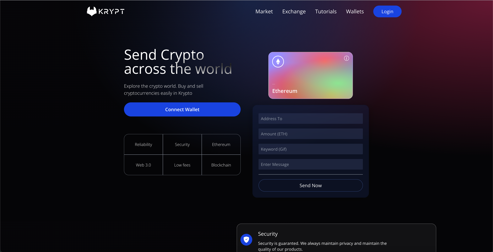

# Blockchain Ethereum Metamask dApp



<div align="center">
  
  
  
</div>

<p align="center" style="width: 90%; margin: 0 auto">
  First <b>Blockchain</b> app where I wrote a smart contract on <b>Solidty</b> and deployed to <b>Alchemy</b> and did some transaction with <i>Ethereum</i> by sending not only a currency, but also a warm message and GIF with it. And used <b>Hardhat</b> for deploying Smart Contract.
</p>

## 📦 Installation
Ensure you have higher than 20 `node.js` version, we used `v20.13.1`.

### 1. [Hardhat](https://hardhat.org/) set up (this step is already done)
- Create a new directory called `smart_contract` in the root of your project
```bash
mkdir smart_contract
```
- Initialize an empty `package.json`
```bash
npm init -y
```
- Intsall following package as **dev dependencies**
```bash
npm install --save-dev @nomicfoundation/hardhat-toolbox @nomiclabs/hardhat-ether @nomiclabs/hardhat-waffle chai ethereum-waffle ethers hardhat
```
- Run init command for initialzing **Hardhat** project
```bash
npx hardhat
```
- Answer sample questions by **Hardhat** for setting up the project.
- Start writing your **smart contract** on **Solidity**.

**Note that the initialized project structure and future deployment commands might differ.*

*For example for deployments `iginition/modules` directory is used, but we created `scripts/deploy.js` directory and file for deployment, also we run other commands for deploying*.

*For more information check [Hardhat documentation](https://hardhat.org/docs).*

- For testing the contract and scripts run
```bash
npx hardhat test
```

**Don't forget to install **Solidity extension** on your IDE or editor for having properly hgihglighted Solidity syntax.*

### 2. [Hardhat](https://hardhat.org/) deployement (these steps are already done)
**Please notice that we did a bit differently rather than the documentation says. You can check in **smart_contract** [README.md](./smart_contract/README.md) file.*
- Create a new `scripts` directory in your `smart_contract` directory and `deploy.js` file in it
```bash
mkdir scripts
touch deploy.js
```
- Copy the code from [`smart_contract/scripts/deploy.js`](./smart_contract/scripts/deploy.js) and paste into your file.
- After havong a Smart Cintract and depoyment script we are ready to deploy. But for this there are some criteria.
  - Have a MetaMask wallet (which can be installed in [chrome webstore](https://chromewebstore.google.com/)).
  - And have some ethereum balnce on it (test ethereum will aslo work). How to gain test ethereum you can check [here](#-faucets).
  - Also account on [Alchemy](https://www.alchemy.com/), whikch is platform for deploying Smart Contracts.
- After doing all mentioned above need to create an application in [Alchemy](https://www.alchemy.com/), which you can do easyly in you [dashbaord page](https://dashboard.alchemy.com/apps) right after registration. *Notice you need to select a test ethereum network for your application if you are developing it. At this moment most popular test network is [Seploia](https://sepolia.etherscan.io/)*.
- After creatiaon you will receive `Http` and `API` keys whcih you need to use in your `hardhat.config.js` file instead of `process.env` placeholders. In this file you need to set configs for your network where you are going to deploy. Check [`hardhat.config.js`](./smart_contract/hardhat.config.js) file.

**Please notice that `@nomiclabs/hardhat-waffle` module is abit old for deplyoing Smart Contract tests, `@nomicfoundation/hardhat-toolbox` can be used instead. Just I am not sure how exactly, you can try and write in discussions if you are feeling lucky with that :)*

- And finally you need you MetaMask **private key** which you can find in you MetaMask account details. 
- So now we are ready to run our deploy script
```bash
npx hardhat run scripts/deploy.js --network sepolia
```
**Notice instead of `--network seploia` can be any another network, but it this moment Sepolia is most actual one.*

- As an output we receive the address of our contract in Alchemy, which is a some hex number like `0x4ef34....4a3f`. This address will be used in our **React app** in future, means on client side.
- And also et will generate a new `artifacts` directory with a few files (which are under .gitignore). So we will need [`Transaction.json`](./smart_contract/artifacts/contracts/Transactions.sol/Transactions.json) file from `smart_contract/artifacts/contracts/Transactions.sol/` directory. In future we will use an information from this file in our client. So we will simply need to copy it into [`client/src/utils`](./client/src/utils/) directory.

### React app set up
Instead of React instalaltion and running process we will deep dive into the functions that were used for **Web 3.0**, as it is a simple [React](https://react.dev/) app set up with [Vite](https://vitejs.dev/) through
```bash
npm init vite@latest
```

All our main Web 3.0 logic is written in [`TransactionContext.jsx`](./client/src/context/TransactionContext.jsx) file.

Let's go over each function and understand what they do for making our ethereum transactions.

**Just one imporatn detail, `ethers` library plays the biggest role for making transactions and connecting MetaMask to our app.**
```bash
npm install ethers
```

### 1. `constants.js`
- As you can see this file is missing in our files, because it contains a sensetive data and I put it under `.gitignore`. However it should look like somthing like this.
```js
import abi from './Transactions.json'; // File genereated after deploying the contract

export const contractABI = abi.abi;
export const contractAddress = '0xa49b....5679e'; // Output after deploying the smart contract
```
- As you remember after [deploying the Smart Contract](#2-hardhat-deployement-these-steps-are-already-done) we receive the **Smart Contract address** in our console and get a `Transactions.json` file in our new genereted `artifacts` folder which is under `.gitignore`. As I mentioned after generating that we bring it into our **client** folder and start using it in our React app.
- As you see we need some `abi` property from that file. If the file was generated successfully there shouldn't be any problems with importing that property.
- Meanwhile explore [`constants.example.js`](./client/src/utils/constants.example.js) file.

### 2. `ethereum` object in `window`
- After installing **Metamask** we always have access to `ethereum` via `window.ethereum`.
- We used it in [this](https://github.com/AlbertArakelyan/blockchain-ethereum-metamask-dapp/blob/main/client/src/context/TransactionContext.jsx#L6) way in our `TransactionContext.jsx` file.

**I will leave referrences to all functions and coe pieces that you can check it right in Github.*

### 3. `getEthereumContract` function
- [getEthereumContract](https://github.com/AlbertArakelyan/blockchain-ethereum-metamask-dapp/blob/main/client/src/context/TransactionContext.jsx#L8-L14) is the first function that we declared. Which is basically for getting deployed smart contract that we created through its `address` and `abi` which we in [`constants.js`](./client/src/utils/constants.example.js) and import in [this](https://github.com/AlbertArakelyan/blockchain-ethereum-metamask-dapp/blob/main/client/src/context/TransactionContext.jsx#L4) way.
- Excpet for `address` and `abi` we use `ethereum` [here](https://github.com/AlbertArakelyan/blockchain-ethereum-metamask-dapp/blob/main/client/src/context/TransactionContext.jsx#L9-L10) for getting some providers.
- And also `etheres` library for getting our contract with its `Contract` library using `address`, `abi` and `signer` from `ethereum` `BrowserProvider` instance (for this we also use `ethers`). We fetch our contract in [this](https://github.com/AlbertArakelyan/blockchain-ethereum-metamask-dapp/blob/main/client/src/context/TransactionContext.jsx#L11-L13) way.
- In `transactionContract` is available any method that we declared in our Smart Contract file which [`Transactions.sol`](./smart_contract/contracts/Transactions.sol).

### 4. `getAllTransactions` function
- [`getAllTransactions`](https://github.com/AlbertArakelyan/blockchain-ethereum-metamask-dapp/blob/main/client/src/context/TransactionContext.jsx#L43-L70) is method decalred in our Smart Contract, you can check [here](https://github.com/AlbertArakelyan/blockchain-ethereum-metamask-dapp/blob/main/smart_contract/contracts/Transactions.sol#L28-L30).
- This function gets simply all transactions transforms it a little and pushes into our state for transactions.
- *Note: All transactions are kept in the appropriate field [declared](https://github.com/AlbertArakelyan/blockchain-ethereum-metamask-dapp/blob/main/smart_contract/contracts/Transactions.sol#L28-L30) in Smart Contract and typed as [TransferStruct struct](https://github.com/AlbertArakelyan/blockchain-ethereum-metamask-dapp/blob/main/smart_contract/contracts/Transactions.sol#L10-L17).*

### 5. `checkIfWalltedConnected` function
- [`checkIfWalltedConnected`](https://github.com/AlbertArakelyan/blockchain-ethereum-metamask-dapp/blob/main/client/src/context/TransactionContext.jsx#L72-L91) function simply checks if we connected our MetaMask wallet to the app or not.
- Firstly it checks if MetaMask is installed or not by [checking](https://github.com/AlbertArakelyan/blockchain-ethereum-metamask-dapp/blob/main/client/src/context/TransactionContext.jsx#L74-L76) if there is `ethereum` object in `window`.
- After that with an appropriate request it [checks](https://github.com/AlbertArakelyan/blockchain-ethereum-metamask-dapp/blob/main/client/src/context/TransactionContext.jsx#L74-L76) if there is a connected account or not. If the account doesn't exist it simply alerts to connect it.
- *Note: if the website has functionality related to **MetaMask** it should provide a proper [Connect](https://github.com/AlbertArakelyan/blockchain-ethereum-metamask-dapp/blob/main/client/src/components/Welcome.jsx#L47-L55) button.*

### 6. `checkIfTransactionsExist` function
- [`checkIfTransactionsExist`](https://github.com/AlbertArakelyan/blockchain-ethereum-metamask-dapp/blob/main/client/src/context/TransactionContext.jsx#L93-L102) function simply checks if there are any transactions by checking their count through [`getTransactionCount`](https://github.com/AlbertArakelyan/blockchain-ethereum-metamask-dapp/blob/main/smart_contract/contracts/Transactions.sol#L32-L34) method declared in our SMart Contract.
- On [this](https://github.com/AlbertArakelyan/blockchain-ethereum-metamask-dapp/blob/main/client/src/context/TransactionContext.jsx#L98) line we convert it into a string and put a `+` in front of it because the returned value is type of `bigInt`.

### 7. `connectWallet` function
- [`connectWallet`](https://github.com/AlbertArakelyan/blockchain-ethereum-metamask-dapp/blob/main/client/src/context/TransactionContext.jsx#L104-L116) function simply does a request for connecting our app to **MetaMask**. Which returns an array of wallet addresses. As we have only one account the first is ours and we simply [set](https://github.com/AlbertArakelyan/blockchain-ethereum-metamask-dapp/blob/main/client/src/context/TransactionContext.jsx#L112) it to our state.

### 8. `sendTransaction` function
- [`sendTransaction`](https://github.com/AlbertArakelyan/blockchain-ethereum-metamask-dapp/blob/main/client/src/context/TransactionContext.jsx#L118-L163) is the last function which transfer the amount of ethereum to another account, where we use both [ethereum object](https://github.com/AlbertArakelyan/blockchain-ethereum-metamask-dapp/blob/main/client/src/context/TransactionContext.jsx#L118-L163) for making a request to another wallet, also [`ethers`](https://github.com/AlbertArakelyan/blockchain-ethereum-metamask-dapp/blob/main/client/src/context/TransactionContext.jsx#L126) library for parcing the amount into hex value.
- Also we use [addToBlockChain](https://github.com/AlbertArakelyan/blockchain-ethereum-metamask-dapp/blob/main/client/src/context/TransactionContext.jsx#L145C57-L145C72) method for [storing](https://github.com/AlbertArakelyan/blockchain-ethereum-metamask-dapp/blob/main/smart_contract/contracts/Transactions.sol#L21-L26) the transfer in our [transfers array](https://github.com/AlbertArakelyan/blockchain-ethereum-metamask-dapp/blob/main/smart_contract/contracts/Transactions.sol#L19) in our Smart Contract, also we emit a [Transfer event](https://github.com/AlbertArakelyan/blockchain-ethereum-metamask-dapp/blob/main/smart_contract/contracts/Transactions.sol#L25) which calls the transfer and tores it on internet, in the network's website which we use in our case **Sepolia**.
- Notice that with [`ethereum.request`](https://github.com/AlbertArakelyan/blockchain-ethereum-metamask-dapp/blob/main/client/src/context/TransactionContext.jsx#L130-L138) we only ask user if he agrees to transfer such amount to another wallet by its address, the rest does Smart Contract by emitting the Transfer event.

## 💸 Faucets
How to gain **some test Ethereum** after connecting to Sepolia test ethereum network? There are two main providers `Google Cloud` and `Alchemy`. I think we are already familiar with both :)
- Alchemy Faucet: https://www.alchemy.com/faucets/ethereum-sepolia (for using this you must have some real ethereum on your balance, while `Google Cloud` is totally free).
- Google Cloud Faucets: https://cloud.google.com/application/web3/faucet/ethereum/sepolia (make sure you chose Seploia, because there is another network called Holesky).

## 😊 Last words
This is basically how the web 3.0 app is set up, how the Smart Contract has been written and deployed. Also how we used it on frontend by explaining each function with all possible referrences.

## 🙏 Contribution
- If you find something incorrect or lacking feel free to fork the repo correct it and open a pull request I will be happy for that ^^
- And also if you have more expertise in Web 3.0 world than feel free to share it with us in our [discussions](https://github.com/AlbertArakelyan/blockchain-ethereum-metamask-dapp/discussions/2), we will highly appreciate it ^^

---

🧑‍💻 Happy hacking to everyone! 